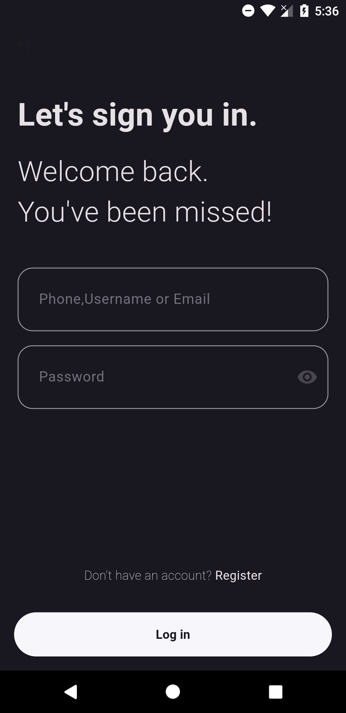
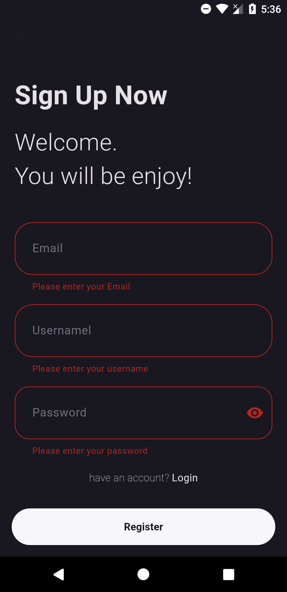

# Flutter Login Signup

A simple authentication app built with Flutter, featuring login and signup functionality using Firebase as the backend.

## Screenshots

## Packages Used

- **`flutter_mobx`**: A state management library that helps manage the state of your application in a reactive way, making it easy to build responsive user interfaces.

- **`firebase_core`**: This package is essential for initializing Firebase in your Flutter app, providing the necessary configuration for using Firebase services.

- **`firebase_auth`**: It provides authentication functionalities, allowing users to sign in and register using various methods, including email/password and social media.

- **`cloud_firestore`**: A NoSQL database service that allows you to store and sync data for your apps at a global scale, providing real-time updates to your application.

- **`mixin`**: Mixins allow you to create classes that provide methods and properties to other classes without being a base class. This feature is useful for reusing code across different classes in your application.
